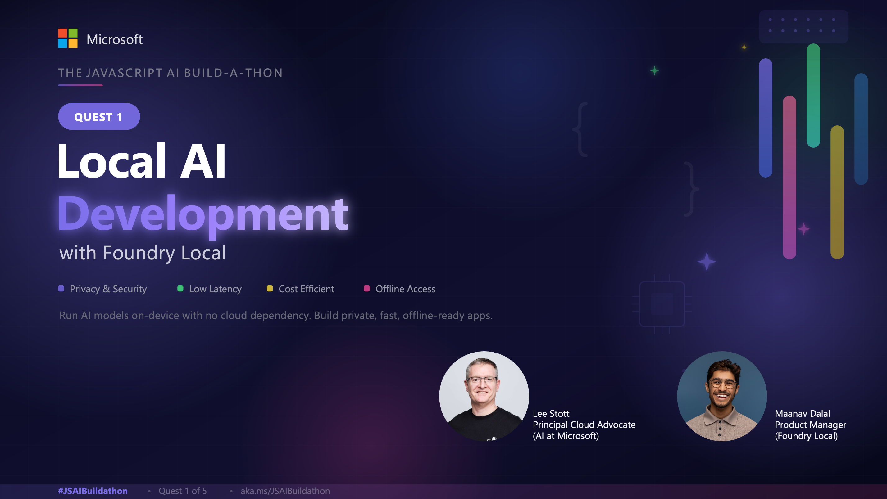
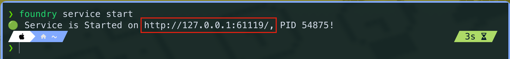
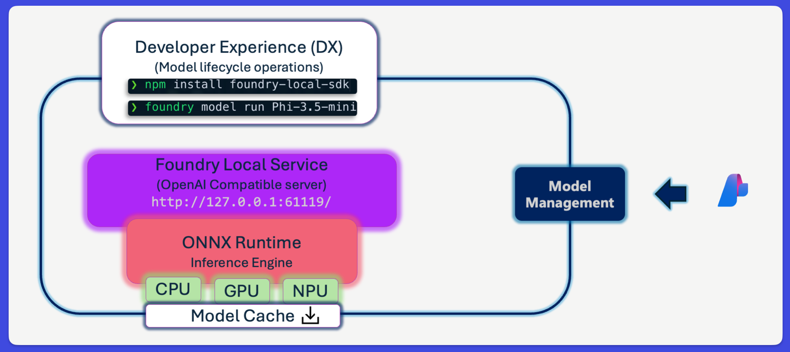
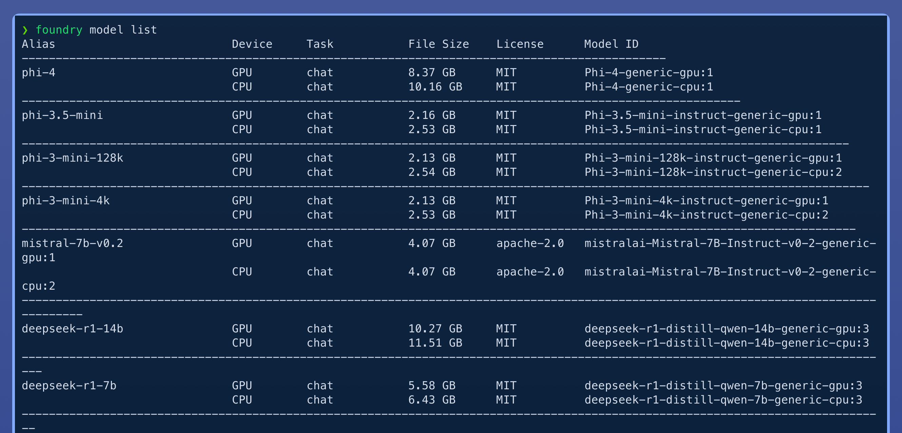
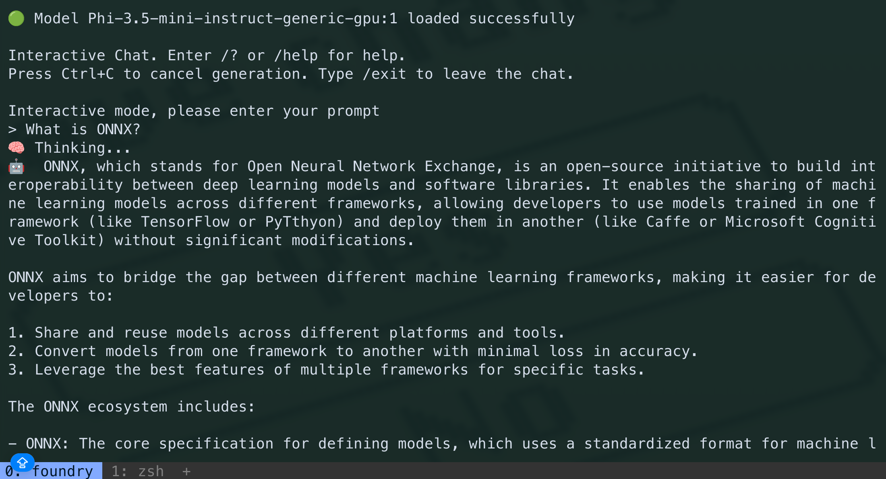
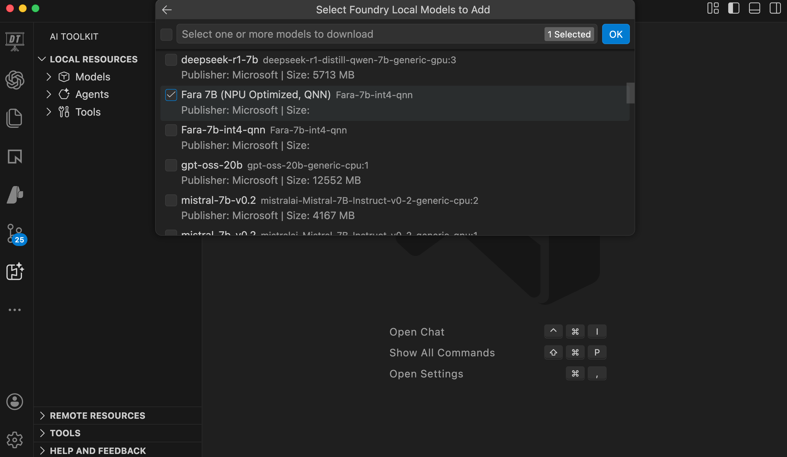
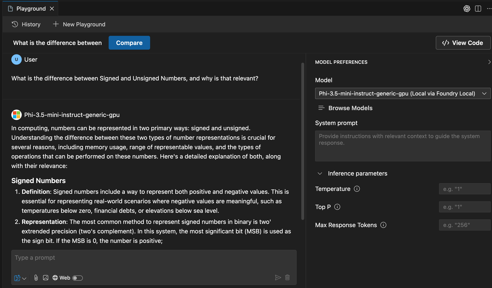
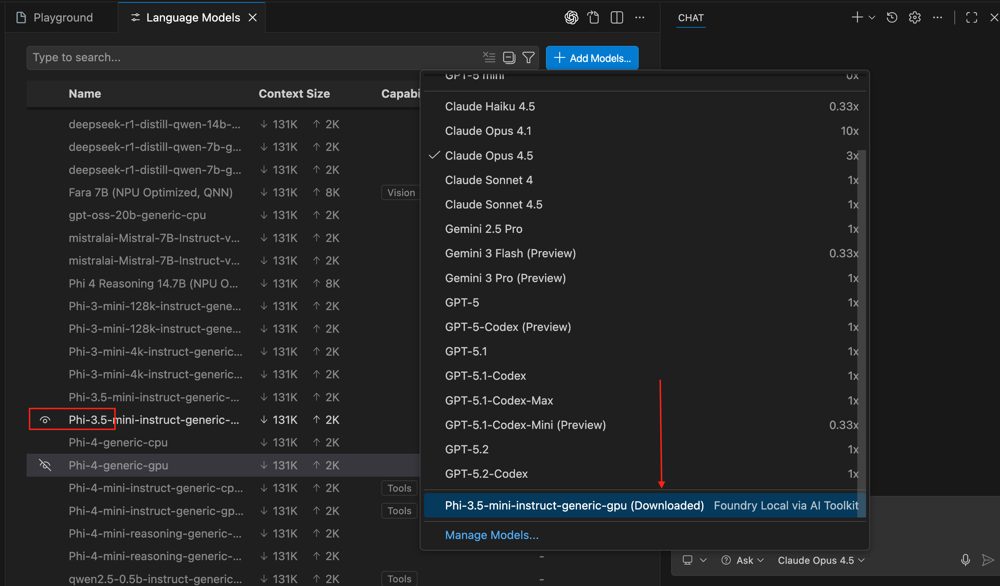
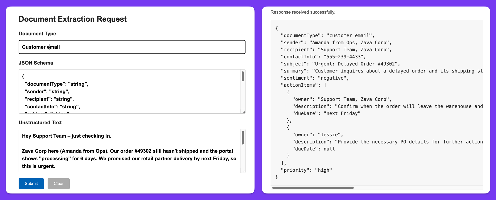

Livestream starting soon! **Click below to watch live.**

[](https://www.youtube.com/live/GHH50rDlLn0?si=-i3hPYq1o6H271_z)

## Overview

In this Quest, you will unlock the power of **Local AI** using **Microsoft Foundry Local**. With Foundry Local, you can run AI models and integrate them into your applications directly on-device, with no reliance on the public cloud.

With Foundry Local, you gain:

- **Privacy & Security**: Keep sensitive data on your device.
- **Low Latency**: Instant responses without network delays.
- **Cost Efficiency**: No cloud compute costs incurred.
- **Offline Access**: AI capabilities even without internet connectivity.

> [!NOTE]
>
> **Hackathon Award Category: Offline-Ready AI Award**
>
> As part of the Build-a-thon Hack!, we have a special award category that will recognize the best performing AI solution with standout offline capabilities (local inference).
>
> Consider building an app that:
>
> - Processes sensitive data entirely on-device.
> - Uses Foundry Local for reasoning and a cloud storage service for optional sync or analytics.
>
> Highlight in your submission how you:
>
> - Achieve **privacy** (no sensitive data leaving the device).
> - Optimize for **latency** using local inference.

First step, **installation instructions** for your OS:

<details>
<summary>Install on Windows</summary>
<br>

  ```bash
  winget install Microsoft.FoundryLocal
  ```
</details>

<details>
<summary>Install on MacOS</summary>
<br>

  ```bash
  brew tap microsoft/foundrylocal
  brew install foundrylocal
  ```
</details>

Once installed, run the following command to start the Foundry Local service:

```bash
foundry service start
```

Let's dive into what is happening under the hood.

## Foundry Local Architecture

What you've started is the **Foundry Local Service**, which provides an **OpenAI-compatible REST server** that acts as a bridge to the **ONNX Runtime** inference engine running on your device.


This API endpoint is dynamically allocated each time the service starts, and you can interact with it in various ways that we'll cover below.

Underneath the Foundry Local Service, is the **ONNX Runtime**, a high-performance inference engine optimized for running AI models on local hardware (CPU/GPU/NPU).

Wrapping around these components is a **model management layer** that holds the:

- **management service** to handle model lifecycle operations.
- **model cache** on disk, which stores downloaded models to ensure they are readily available for inference without re-downloading.



## Model Lifecycle on Foundry Local

To list models available for local inferencing, run:

```bash
foundry model list
```



Each model has:

- An **alias**: a friendly name for easy reference (e.g., `phi-3.5-mini`).
- Device compatible variants (e.g., CPU, GPU, NPU) to automatically leverage your hardware optimally.
- A **model ID**: a unique identifier for precise model selection (e.g., `Phi-4-generic-gpu:1`).
- **Licence, size, and task** information.

The Foundry Local model lifecycle consists of the following stages:

#### 1. Download model

- Fetch the model from the Foundry model catalog to local disk. Run:

    ```bash
    foundry model download <model-alias>
    ```

  *Get `<model-alias>` from the `Alias` column in the model list output.* Downloaded models are automatically cached for more efficient subsequent use. You can inspect the model cache with `foundry cache ls`.

#### 2. Load model

- Load the model into the local management service memory for inference. Run:

    ```bash
    foundry model load <model-alias>
    ```

#### 3. Run model

- Execute inference requests against the loaded model. Run:

    ```bash
    foundry model run <model-alias>
    ```

  *If you directly run a model that hasn't been downloaded or loaded yet, Foundry Local will automatically handle those steps for you.*

#### 4. Unload model

- Remove the model from memory to free up memory resources when not in use. Run:

    ```bash
    foundry model unload <model-alias>
    ```

## Developer Experience on Foundry Local

Foundry Local provides multiple ways to interact with and integrate local AI models:

### 1. Command Line Interface (CLI)

In step 4 of the model lifecycle above, we used the CLI to run inference against a model. This is a powerful way to quickly experiment with local models directly from your terminal.



### 2. AI Toolkit Extension for VS Code

The **AI Toolkit for VS Code** extension complements the discovery and experimentation with local models by providing a graphical interface directly within VS Code.

- **Step 1**: Install the [AI Toolkit extension](https://marketplace.visualstudio.com/items?itemName=ms-windows-ai-studio.windows-ai-studio) from the Extensions marketplace.

- **Step 2**: Open the `AI Toolkit` extension, under `Local Resources`, hover on `Models` and click the `+` icon.

- **Step 3**: Select `Add Foundry Local Model` and select a model from the dropdown. Click `Ok`.

    

Once added *(and this may take a few moments to download and load the model)*, you can interact with it in two ways:

#### Option A: Model Playground

Use the built-in playground to test your local model with chat completions or other inference requests.

- **Step 4**: Under **Tools** >> **+ Build**, select **Model Playground** and on the **Model** setting, choose your Foundry Local model.

    

#### Option B: Power GitHub Copilot with Local Models

You can use your Foundry Local models directly with GitHub Copilot Chat - keeping your AI coding assistance entirely on-device for maximum privacy.

> [!TIP]
>
> This is ideal for sensitive codebases or regulated environments where data cannot leave your device, and for working fully offline.

*Ensure you have the [GitHub Copilot extension](https://marketplace.visualstudio.com/items?itemName=GitHub.copilot) installed.*

- **Step 4**: Open GitHub Copilot Chat and click the **model picker** dropdown.

- **Step 5**: Click on **Manage models** at the bottom of the model picker, and expand the **Foundry Local via AI Toolkit** section.

- **Step 6**: Select your preferred local model (e.g., `phi-3.5-mini`, `Qwen`, or other supported models). Right click and select **Show in the Chat model picker**. AI Toolkit will prompt you to download the model if it hasn't been cached locally.

    

Once configured, GitHub Copilot Chat will use your local Foundry model for all responses. You can switch between local and cloud models at any time using the model picker.

**Recommended Models for Code Tasks**:

| Model | Best For |
|-------|----------|
| **Phi models** | Reasoning, code generation, natural language understanding |
| **Qwen models** | Multilingual code generation |
| **GPT models** | Advanced capabilities and broad compatibility |

> [!NOTE]
>
> For the Offline-Ready AI Award, using GitHub Copilot with Foundry Local demonstrates a powerful offline development workflow. Highlight this capability in your submission!

### 3. Software Development Kits (SDKs)

Foundry Local provides SDKs to programmatically send requests to the local management service. Since the endpoint is dynamically allocated each time the service starts, the SDK handles endpoint discovery and management for you (control plane).

#### Step 1: Initialize New Project

Create a parent folder for your Build-a-thon projects and navigate into it:

   ```bash
    mkdir buildathon
    cd buildathon
  ```

  Create a new folder for this quest, navigate into it and initialize a Node.js project:

   ```bash
   mkdir foundry-local-quest
   cd foundry-local-quest
   npm init -y
   npm pkg set type=module
   ```
  
#### Step 2: Install Foundry Local SDK and LangChain

To interact with Foundry Local programmatically, install the Foundry Local SDK along with LangChain. LangChain is a powerful framework for building AI applications and Agents, providing pre-built components and patterns to streamline AI development.

> [!NOTE]
> After completing this quest, you can visit our free [LangChain.js for Beginners Course](https://github.com/microsoft/langchainjs-for-beginners) to learn more about building AI app & Agents with LangChain.

  ```bash
  npm install foundry-local-sdk @langchain/openai @langchain/core
  ```

#### Step 3: Exercise: Create an AI Insight Mapper App

Scenario: Assume you want to extract structured data from unstructured inputs like customer support emails for an automated CRM system.

Create `insight_mapper.js` and add the following code:

<details open>
<summary>insight_mapper.js</summary>

```javascript
  import { FoundryLocalManager } from "foundry-local-sdk";
  import { ChatOpenAI } from "@langchain/openai";
  import { ChatPromptTemplate } from "@langchain/core/prompts";

  const alias = "phi-3.5-mini";

  const foundryLocalManager = new FoundryLocalManager()

  const modelInfo = await foundryLocalManager.init(alias)
  console.log("Model Info:", modelInfo)

  const llm = new ChatOpenAI({
      model: modelInfo.id,
      configuration: {
          baseURL: foundryLocalManager.endpoint,
          apiKey: foundryLocalManager.apiKey
      },
      temperature: 0.6,
      streaming: false,
      maxTokens: 5000
  });

  const prompt = ChatPromptTemplate.fromMessages([
      {
          role: "system",
          content: [
              "You are InsightMapper, an expert that extracts consistent structured data as JSON.",
              "Always answer with VALID JSON using double quotes.",
              "Never add commentary, markdown, or surrounding text.",
              "If a field cannot be determined, output null for that field."
          ].join(" ")
      },
      {
          role: "user",
          content: [
              "Document type: {document_type}",
              "Target JSON schema:",
              "{json_schema}",
              "",
              "Unstructured text:",
              "{input}",
              "",
              "Return ONLY the JSON formatted according to the schema."
          ].join("\n")
      }
  ]);

  const chain = prompt.pipe(llm);

  const demoName = "InsightMapper JSON Extractor";
  const documentType = "customer support email";
  const schemaDefinition = `{
    "documentType": "string",
    "sender": "string",
    "recipient": "string",
    "contactInfo": "string",
    "subject": "string",
    "summary": "string",
    "sentiment": "one of: positive | neutral | negative",
    "actionItems": [
      {
        "owner": "string",
        "description": "string",
        "dueDate": "ISO 8601 date or null"
      }
    ],
    "priority": "one of: low | medium | high"
  }`;

  const messyInput = `Hey Support Team – just checking in.

  Zava Corp here (Amanda from Ops). Our order #49302 still hasn't shipped and the portal shows ''processing'' for 6 days. We promised our retail partner delivery by next Friday, so this is urgent.

  Can someone confirm:
  - When will it leave the warehouse?
  - Do we need to upgrade shipping to hit the deadline?

  Loop in Jessie if you need PO details. Please call me at 555-239-4433.

  Thanks!`;

  console.log(`\nRunning ${demoName}...`);

  chain.invoke({
      document_type: documentType,
      json_schema: schemaDefinition,
      input: messyInput
  }).then(aiMsg => {
      const rawContent = Array.isArray(aiMsg.content)
          ? aiMsg.content.map(part => typeof part === "string" ? part : part?.text ?? "").join("")
          : String(aiMsg.content);

      try {
          const parsed = JSON.parse(rawContent);
          console.log("\nStructured JSON Output:\n", JSON.stringify(parsed, null, 2));
      } catch (parseError) {
          console.warn("\nReceived non-JSON output, displaying raw content:");
          console.log(rawContent);
      }
  }).catch(err => {
      console.error("Error:", err);
  });
```

</details>

Run the code using `node insight_mapper.js`

> Note that the initial run might be slow if the model is still being downloaded.

#### Step 4: Code Explanation and modifications using GitHub Copilot

GitHub Copilot, your AI peer programmer, can help you understand the code above and make further modifications. To get started, ensure you have [access to GitHub Copilot](https://github.com/copilot), free tier available.

Here are some suggested prompts to use. Iterate as needed:

<details>
<summary>Code Explanation</summary>

```
@workspace /explain the purpose and flow of the code in #insight_mapper.js
``` 

- `@workspace` tells Copilot to focus on the project context.
- `/explain` is a pre-defined command to generate explanations.
- `#insight_mapper.js` specifies the target file.

</details>

<details>
<summary>Build a Simple API Server</summary>

```
Generate a minimal Node.js HTTP server without frameworks. Reuse "foundry-local-sdk" and the same alias from #file:insight_mapper.js to initialize FoundryLocalManager once at startup, obtain the model info, and keep the chain ready. Expose POST /extract that reads raw JSON from the request body, invokes the InsightMapper chain with fields "document_type", "json_schema", and "input" taken from the payload, and returns the model’s JSON response unmodified. Include instructions to run with "node server.js", ensure error handling for JSON parsing and chain failures, and keep the code under 80 lines. Ensure you test the server
```

</details>

<details>
<summary>Create a Simple HTML UI</summary>

```
Provide a standalone HTML file (no external libraries) containing a form with fields for document type, JSON schema, and unstructured text. On submit, prevent default behaviour, gather the values, POST them as JSON to <INSERT YOUR API ENDPOINT HERE>, and display the returned JSON below the form with basic formatting. Handle network or parsing errors gracefully, keep styles minimal and inline, and ensure the markup is concise and easy to copy-paste.
```

Example UI:

</details>

## Stay connected

Have a question, project or insight to share? Post in the [Local AI discussion hub](https://github.com/Azure-Samples/JavaScript-AI-Buildathon/discussions/88)

## AI Note

This quest was partially created with the help of AI. The author reviewed and revised the content to ensure accuracy and quality.