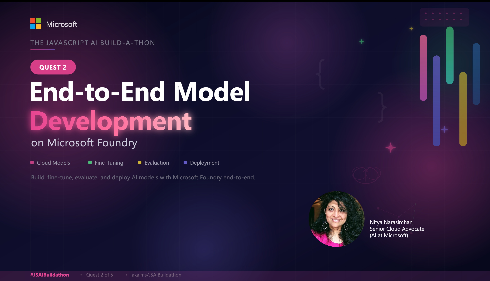

Livestream starting soon! **Click below to register.**

# Building AI Agents E2E On Microsoft Foundry

_In the previous quest, you used Foundry Local to deploy and use models locally, to build on-device AI solutions. But what if you want to build enterprise-grade AI solutions at cloud-scale? This is where Microsoft Foundry comes in._

In this Quest, you'll explore the end-to-end workflow for designing and developing AI solutions with _Microsoft Foundry models_ in the cloud. You'll learn to select models (using catalog, leaderboards, and playground), customize them (with fine-tuning) - then observe their performance and assess their quality and safety (with tracing, evaluations, and red-teaming). By completing this quest, you'll get a better intuition for what it takes to build trustworthy AI using Microsoft Foundry.

Let's set the stage with a popular real-world use case. 

Imagine you are an AI engineer working for _Zava_, a fictitious enterprise retail organization selling home improvement products to DIY customers. You have been asked to build "Cora" - a customer service agent that answers shopper questions in-store and online. In this quest, we'll keep it simple and have the agent answer questions about the products in a provided catalog.

The AI Agent must meet three objectives:

1. **Be polite and helpful** in customer interactions. _Meet specific response tone and format_.
1. **Be cost-effective** in operations. _Minimize latency and token costs in usage_.
1. **Be trustworthy** in responses. _Ensure safety, quality & accuracy in responses_.

_How do we go from these requirements - to plan, prototype and production?_

## Developer Journey

Coming soon!
