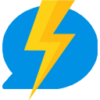
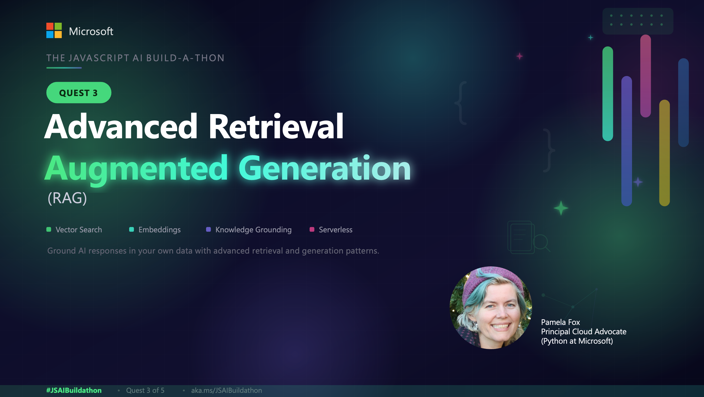
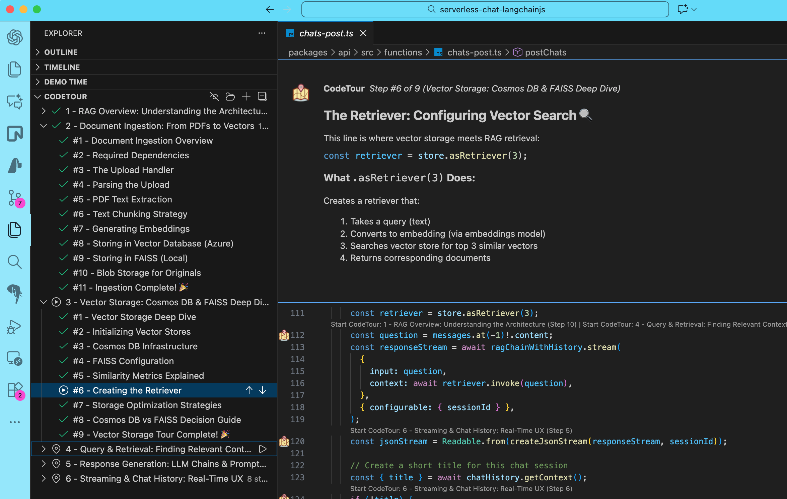
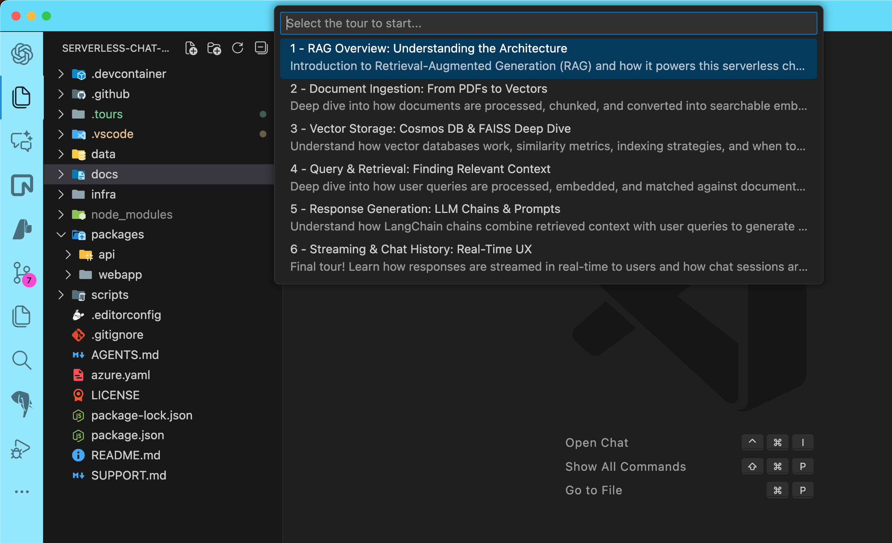

Livestream starting soon! **Click the image below to watch the recording.**

[](https://www.youtube.com/live/hfx7F7lObdg?si=vEtg3dt411oHcvJG)

## Overview

In this quest, you will set up and run a **Serverless Retrieval-Augmented Generation (RAG)** support system using the provided codebase. Once you have completed the setup, you will start a CodeTour that will guide you through each step of the RAG implementation with detailed explanations.



## Steps to Complete the Quest

### Codebase Setup

1. **Fork and Clone the Repository**: Start by [forking](https://github.com/Azure-Samples/serverless-chat-langchainjs/fork) the Serverless RAG with LangChain repository to your GitHub account and then clone it.

    ```bash
    git clone https://github.com/<your-username>/serverless-chat-langchainjs.git
    ```

    Navigate to the project directory:

    ```bash
    cd serverless-chat-langchainjs
    ```

2. **Download Ollama** (if you haven't already): You won't need to deploy to Azure for this quest, but you will need to connect to local models for text completions and embeddings. 

    > [!NOTE]  
    > Foundry Local doesn't support embeddings models yet, so you'll need to use Ollama for this quest.

    Download and install Ollama from [ollama.com](https://ollama.com/).

3. **Pull the Required Models**: Open your terminal and run the following commands to pull the necessary models for text completions and embeddings:

    ```bash
    ollama pull llama3.1:latest
    ollama pull nomic-embed-text:latest
    ```
4. **Install Dependencies**: Install the required project dependencies using:

    ```bash
    npm install
    ```

5. **Start the Application**: 

    Launch the application with:

    ```bash
    npm start
    ```

    Then, in a separate terminal, run the following command to upload the PDF documents from the `/data` folder to the API:

    ```bash
    npm run upload:docs
    ```

    Interact with the application by asking questions related to the uploaded documents and observe how the RAG system retrieves and generates responses based on the content.

    > [!NOTE]  
    > While local models usually work well enough to answer the questions, sometimes they may not be able to perfectly follow the advanced formatting instructions for the citations and follow-up questions.
    >
    > This is expected, and a limitation of using smaller local models.

### Start the CodeTour

This quest is designed to give you a guided tour of the codebase and its implementation of the complete RAG pipeline. To start the CodeTour:

1. **Install the CodeTour Extension**: If you haven't already, install the [CodeTour extension](https://marketplace.visualstudio.com/items?itemName=vsls-contrib.codetour) in Visual Studio Code.

2. **Open the CodeTour**: Open the Command Palette (Ctrl+Shift+P or Cmd+Shift+P on Mac) and type "**CodeTour: Start Tour**".

    

There are 6 tours to walk you through the entire RAG implementation flow. We recommend going through them in order as they build upon each other.

- Tour 1: RAG Architecture (10 steps)
- Tour 2: Document Ingestion (10 steps)
- Tour 3: Vector Storage (8 steps)
- Tour 4: Query & Retrieval (7 steps)
- Tour 5: Response Generation (7 steps)
- Tour 6: Streaming & Chat History (8 steps)

### Return to the Build-a-thon

Once you have completed the CodeTour and explored the RAG implementation, return to the main Build-a-thon repository to continue with the next quests.

## Stay connected

Have a question, project or insight to share? Post in the [RAG discussion hub](https://github.com/Azure-Samples/JavaScript-AI-Buildathon/discussions/89)

## AI Note

This quest was partially created with the help of AI. The author reviewed and revised the content to ensure accuracy and quality.