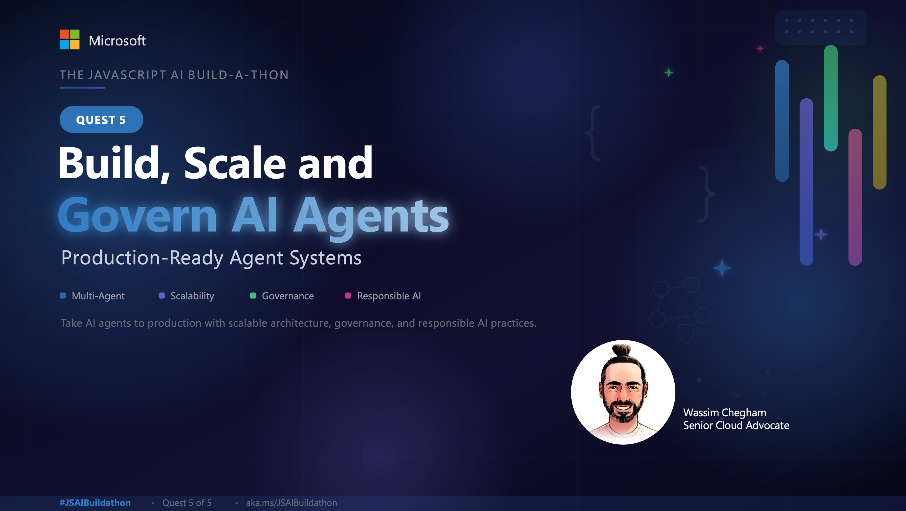
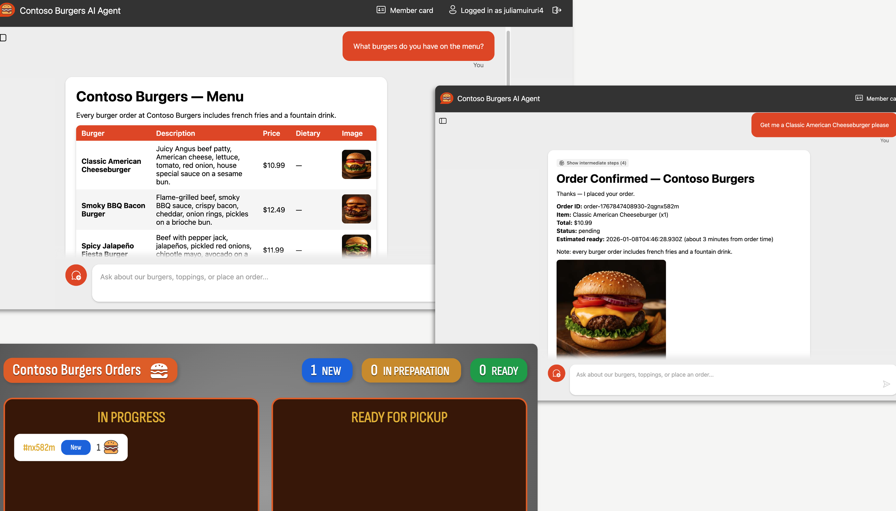
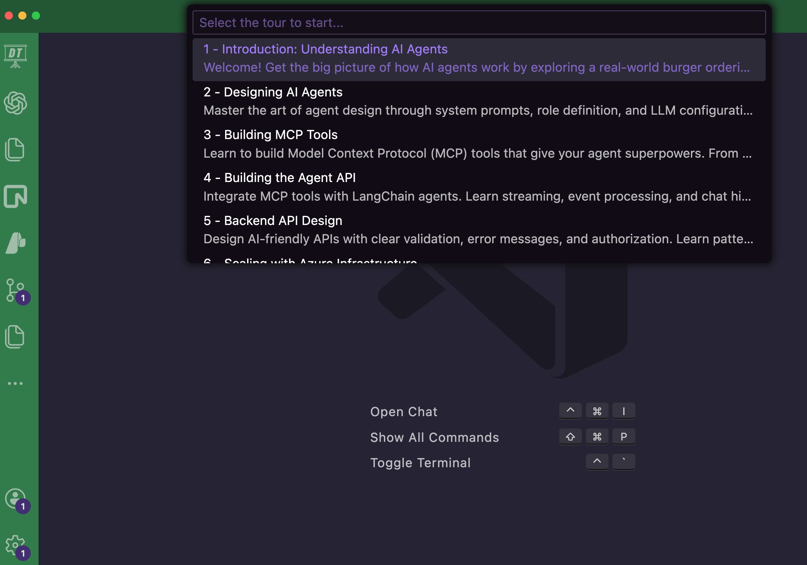

Livestream starting soon! **Click the image below to register.**

[](https://developer.microsoft.com/en-us/reactor/events/26786/)

## Overview

In this quest, you will set up and run a **complete end-to-end Burger Ordering Agent system** using LangChain.js. Once you have completed the setup, you will start a CodeTour that will guide you through each step of the Agentic solution design and implementation with detailed explanations.



> [!NOTE]
>
> **Hackathon Award Category: Agentic System Architecture Award**
>
> As part of the Build-a-thon Hack!, we have a special award category recognizing agentic designs that are **useful, reliable, and secure**.
>
> This quest demonstrates foundational patterns: **MCP tool integration** enables agents to interact with external systems (useful), **structured agent workflows** with proper error handling ensure consistent behavior (reliable), and **API-based architectures** allow for controlled access and validation (secure).
>
> Consider how these patterns can help you build production-ready agent systems that users can trust.

## Steps to Complete the Quest

### Codebase Setup

1. **Fork and Clone the Repository**: Start by [forking](https://github.com/Azure-Samples/mcp-agent-langchainjs/fork) the AI Agent with MCP tools using LangChain.js repository to your GitHub account and then clone it.

    ```bash
    git clone https://github.com/<your-username>/mcp-agent-langchainjs.git
    ```

    Navigate to the project directory:

    ```bash
    cd mcp-agent-langchainjs
    ```

2. **Install Dependencies**: Install the required project dependencies using:

    ```bash
    npm install
    ```

3. **Start the Application**: 

    Launch the application with:

    ```bash
    npm start
    ```

> [!NOTE]
> Starting the different services may take some time, you need to wait until you see the following message in the terminal: **🚀 All services ready 🚀**
>
> This will start:
>
> - Agent Web App: http://localhost:4280
> - Agent API: http://localhost:7072
> - Burger Web App: http://localhost:5173
> - Burger API: http://localhost:7071
> - Burger MCP Server: http://localhost:3000

### Start the CodeTour

This quest is designed to give you a guided tour of the codebase and its implementation of the complete Agentic solution. Follow these steps to start the CodeTour:

1. **Install the CodeTour Extension**: If you haven't already, install the [CodeTour extension](https://marketplace.visualstudio.com/items?itemName=vsls-contrib.codetour) in Visual Studio Code.

2. **Open the CodeTour**: Open the Command Palette (Ctrl+Shift+P or Cmd+Shift+P on Mac) and type "**CodeTour: Start Tour**".

    

There are 6 tours to walk you through the entire agent implementation flow. We recommend going through them in order as they build upon each other.

- Tour 1: Introduction: Understanding AI Agents (7 steps)
- Tour 2: Designing AI Agents (8 steps)
- Tour 3: Building MCP Tools (10 steps)
- Tour 4: Building the Agent API (7 steps)
- Tour 5: Backend API Design (7 steps)
- Tour 6: Scaling with Azure Infrastructure (4 steps)

> [!WARNING]
> Trouble viewing the CodeTour? Try setting `comments.maxHeightExceeded` to `false`

### Return to the Build-a-thon

Once you have completed the CodeTour and explored the Agent implementation, return to the main Build-a-thon repository to continue with the next step.

## Stay connected

Have a question, project or insight to share? Post in the [Agentic Systems discussion hub](https://github.com/Azure-Samples/JavaScript-AI-Buildathon/discussions/91)

## AI Note

This quest was partially created with the help of AI. The author reviewed and revised the content to ensure accuracy and quality.