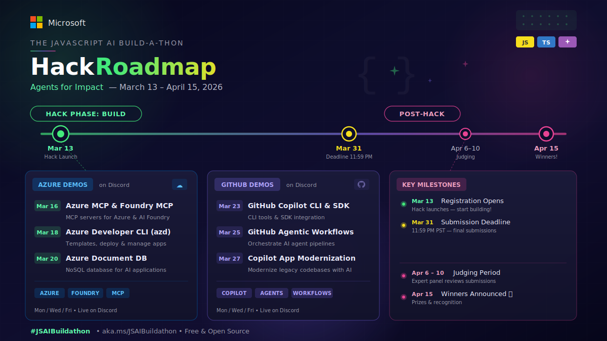
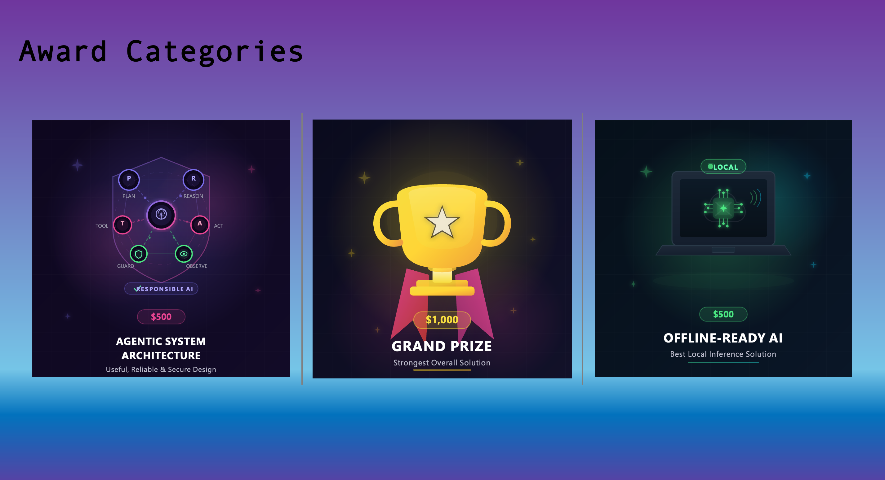

---
hide:
  - navigation
---

---

# 🚀 Build, Innovate, and Ship working AI!

**The JavaScript AI Build-a-thon** is a focused, hands-on initiative that helps builders quickly move from exploration to working AI prototypes. Through concise quests and practical demos, you'll gain real skills with modern AI tools in a clear, outcome-driven format.

**This isn't just another hackathon. It's your launchpad into the Agentic future of JavaScript and TypeScript development.**

!!! tip "📅 **Key Dates**"

    * 🎬 Build-a-thon Begins: **Monday, March 2, 2026**
    * 📚 Quests & Livestreams: **March 2 – March 13, 2026**
    * 🔥 **Hackathon Launches**: **Friday, March 13, 2026**
    * 🏁 Hackathon Ends: **Tuesday, March 31, 2026**

## 🎟️ Registration

[**Register for the hackathon**](https://aka.ms/JSBuildathon_Hack)

Once you're registered, [introduce yourself](https://aka.ms/JSAIonDiscord) in the Build-a-thon channel and connect with other builders to find teammates.

## ⚙️ How It Works

The Build-a-thon runs in two phases:

### 📚 Phase 1: Learn & Skill Up (March 2 – March 13)

Complete guided [quests](quests.md) and attend expert-led livestreams to build the skills you need. Each quest is hands-on, self-paced, and teaches a core AI development pattern with JavaScript/TypeScript.

### 🔥 Phase 2: Hack! (March 13 – March 31)

Build something that matters. Use everything you learned — and beyond — to build AI agents that solve real problems.

## 🎥 Office Hours Schedule

During the hack phase, attend technical demos and special Discord Office Hours (8:00 AM PDT) to learn the latest AI tools, best practices, and get help with your project

| Day/Time (PT) | Topic |
|---|---|
| [Mon 3/16, 8:00 AM PDT](https://discord.gg/microsoftfoundry?event=1476309470312136704) | Azure & Foundry MCP Server Demo |
| [Mon 3/18, 8:00 AM PDT](https://discord.gg/microsoftfoundry?event=1476310190885175296) | Azure Developer CLI (azd) Demo |
| [Wed 3/20, 8:00 AM PDT](https://discord.gg/microsoftfoundry?event=1473725339959033866) | Azure DocumentDB Demo |
| [Wed 3/23, 8:00 AM PDT](https://discord.gg/microsoftfoundry?event=1473726030421430272) | GitHub Copilot CLI & SDK Demo |
| [Fri 3/25, 8:00 AM PDT](https://discord.gg/microsoftfoundry?event=1473781418956947566) | GitHub Agentic Workflows Demo |
| [Fri 3/27, 8:00 AM PDT](https://discord.gg/microsoftfoundry?event=1473781883811795147) | GitHub Copilot App Modernization Demo |

## ⚖️ Judging Criteria

| Criteria | Weight |
|---|---|
| Depth of AI Integration | 25% |
| Technical Implementation & User Experience | 20% |
| Use of Responsible AI Patterns | 15% |
| Solution Value (Potential of your solution to solve real-world problems) | 15% |
| Innovation & Creativity | 10% |
| Documentation & Storytelling | 10% |
| Compliance with the Award Category | 5% |

## 🏆 Award Categories

### ✨ Special Spotlight: AI-Builder Award

!!! note
    Did you use AI to build your AI? We want to see it!

This special recognition goes to builders who go beyond just building with AI — they show how they built. Share your prompts, workflows, tips, and tricks with the community.

We will be giving away **10 GitHub Copilot Pro + licenses** for this award, and here is how you can stand out: 

1. 🪄 Share your prompts & prompt engineering strategies in your submission, blog post, and on Discord using the provided template
1. 🔧 Document your AI tools & workflows — how you used GitHub Copilot, AI Toolkit, Copilot CLI, or other AI-assisted tools
1. 💬 Be active in the community — post tips, answer questions, and share what you're learning in Discord
1. 📝 Share what worked and what didn't — your honest takeaways help everyone level up

!!! note
    We'll be watching both submissions and community contributions. This isn't about perfection — it's about transparency, generosity, and helping others learn. The best AI builders lift the whole community.

## 🏁 Project Submission

Submit your project on [Innovation Studio](https://aka.ms/JSBuildathon_Hack). Your submission must include:

1. **GitHub repository**: URL to your project's code for judging and testing
2. **Technical blog**: URL to a blog post with a step-by-step walkthrough of your project
3. **Project video**: 3–5 minute demo on YouTube, Vimeo, or Facebook (public)
4. **GitHub usernames**: For ALL team members

!!! warning
    Judging time per project is strictly under 5 minutes — make your demo count!

## 💬 Community & Support

-   <svg xmlns="http://www.w3.org/2000/svg" viewBox="0 0 24 24" width="28" height="28" fill="#5865F2" style="vertical-align:middle;margin-right:.4em"><path d="M20.317 4.37a19.791 19.791 0 0 0-4.885-1.515.074.074 0 0 0-.079.037c-.21.375-.444.864-.608 1.25a18.27 18.27 0 0 0-5.487 0 12.64 12.64 0 0 0-.617-1.25.077.077 0 0 0-.079-.037A19.736 19.736 0 0 0 3.677 4.37a.07.07 0 0 0-.032.027C.533 9.046-.32 13.58.099 18.057a.082.082 0 0 0 .031.057 19.9 19.9 0 0 0 5.993 3.03.078.078 0 0 0 .084-.028c.462-.63.874-1.295 1.226-1.994a.076.076 0 0 0-.041-.106 13.107 13.107 0 0 1-1.872-.892.077.077 0 0 1-.008-.128 10.2 10.2 0 0 0 .372-.292.074.074 0 0 1 .077-.01c3.928 1.793 8.18 1.793 12.062 0a.074.074 0 0 1 .078.01c.12.098.246.198.373.292a.077.077 0 0 1-.006.127 12.299 12.299 0 0 1-1.873.892.077.077 0 0 0-.041.107c.36.698.772 1.362 1.225 1.993a.076.076 0 0 0 .084.028 19.839 19.839 0 0 0 6.002-3.03.077.077 0 0 0 .032-.054c.5-5.177-.838-9.674-3.549-13.66a.061.061 0 0 0-.031-.03Z"/></svg> **Discord**

    ---

    Office hours throughout the build-a-thon, plus quick questions and community support

    [**Join Discord →**](https://aka.ms/JSAIonDiscord)

-   <svg xmlns="http://www.w3.org/2000/svg" viewBox="0 0 24 24" width="28" height="28" fill="currentColor" style="vertical-align:middle;margin-right:.4em"><path d="M18.244 2.25h3.308l-7.227 8.26 8.502 11.24H16.17l-5.214-6.817L4.99 21.75H1.68l7.73-8.835L1.254 2.25H8.08l4.713 6.231zm-1.161 17.52h1.833L7.084 4.126H5.117z"/></svg> **Social**

    ---

    Share your progress with **#JSAIBuildathon** on social media

